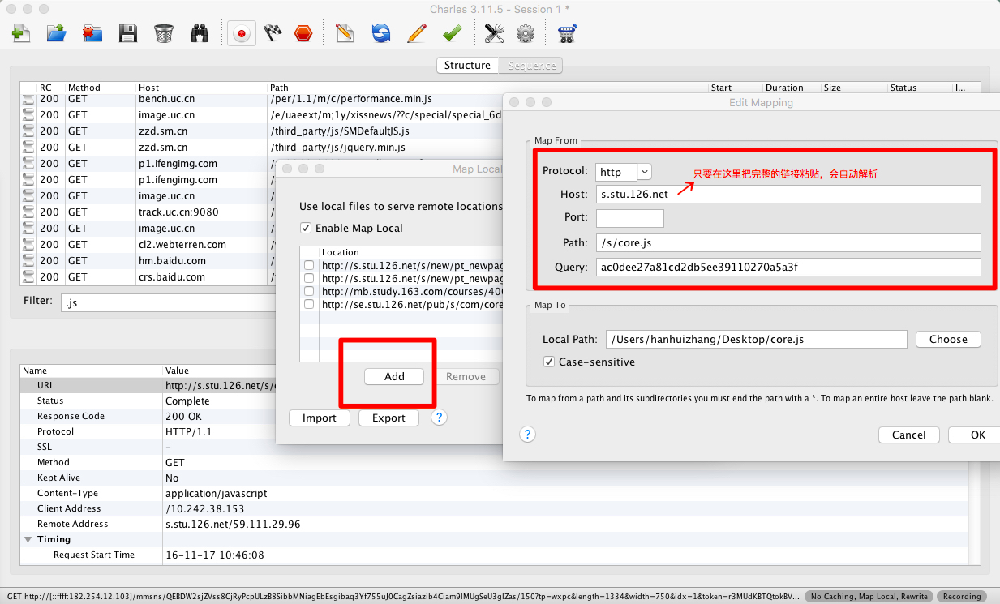
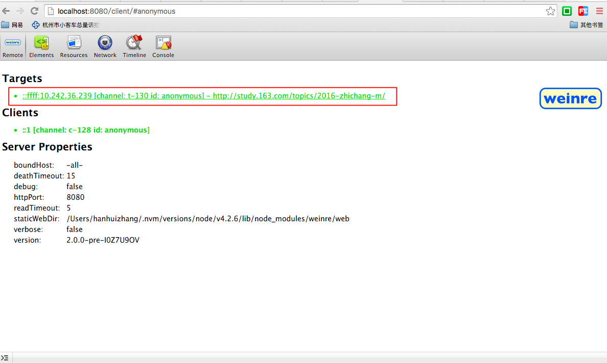
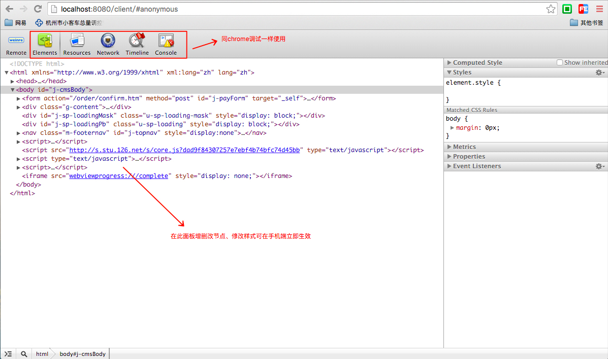

### 移动端页面调试方法

### 开发过程问题排查

1. **Chrome Emulation**
	
	关键词：使用方便
	
	* 模拟各种设备尺寸、像素比、自定义userAgent
	* 模拟触摸、经纬度、重力感应
	* 模拟4g网络等不同类型的网络
	
2. **browser-sync**

	关键词：提升开发效率
	
		安装步骤：
		npm install -g browser-sync
	
		// 以当前目录为根，启动一个静态服务器，文件修改页面自动刷新
		browser-sync start --server --files "css/*.css, *.html"
	
		// 设置代理
		browser-sync start --proxy "127.0.0.1:8000/buyer" --files "css/*.css, *.html"
		
		

### 线上问题排查
1. Charles 的Map Local工具
		
	关键词：快速定位问题
	
		
		

2. Weinre
	关键词：简单易用、专治疑难杂症

	使用步骤如下：
	
	1. 安装
	npm install -g weinre
	
	2. 运行
	
	weinre --httpPort 8080 --boundHost -all-
	
	3. 调试
		
		 
		将localhost替换为机器电脑IP，插入需要调试的页面。
		ps：如果是线上或者测试环境页面可以用charles Map Local本地修改。
	
	4. 手机访问
	
		使用charles代理到本地，访问需要调试的页面。
		
		可以看到连接的target
		
		
		
		
		
		
		
		

